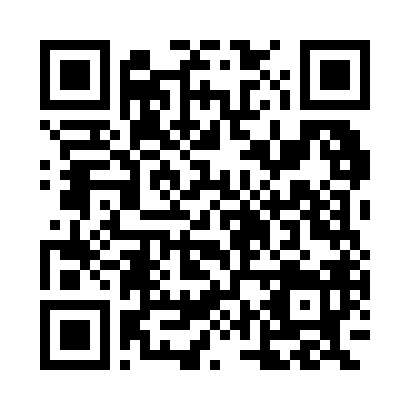

# VA_CS_Enrollment_SOL_Analysis
Analysis of Virginia high-school computer science enrollment and its relationship to SOL pass rates.

# High School Computer Science Enrollment and Academic Outcomes in Virginia

**Author:** Terrie McClure  
**Program:** M.S. Data Analytics Engineering, George Mason University  
**Course:** AIT-580 — Data Analytics Engineering  
**Date:** October 2025  

---

## 🎯 Research Overview
This project investigates whether participation in **high school Computer Science (CS)** courses correlates with improved **academic outcomes** across both STEM and non-STEM subjects in **Virginia public schools**.

The analysis integrates **Virginia Department of Education (VDOE)** Standards of Learning (SOL) pass-rate data with **U.S. Department of Education Civil Rights Data Collection (CRDC)** CS enrollment data for school year 2021–2022.

---

## 📊 Research Questions

1. Does access and participation in high school CS classes improve student outcomes inside and outside of STEM?
2. Do schools with higher CS enrollment rates also have higher overall SOL pass rates?
3. Do schools with higher CS enrollment rates have higher **non-STEM** SOL pass rates?
4. Does the relationship between CS enrollment and SOL outcomes differ by **gender** or **race**?

---

## 🧠 Data Sources

- [VDOE SOL Data](https://www.doe.virginia.gov/)
- [CRDC Data](https://civilrightsdata.ed.gov/)

| Dataset | Description | Source |
|----------|--------------|--------|
| `SOL_Assessments.csv` | SOL test pass rates for all Virginia schools (2021–22) | [VDOE SOL Test Results](https://www.doe.virginia.gov/data-policy-funding/data-reports/statistics-reports/sol-test-pass-rates-other-results) |
| `CS_Enrollment.csv` | High school Computer Science enrollment, gender breakdowns | [CRDC 2021–22](https://civilrightsdata.ed.gov/data) |
| `SOL_CS.csv` | Merged dataset used for analysis (stored in AWS S3) | [AWS S3 Dataset](https://bucket4ait580-tm.s3.us-east-1.amazonaws.com/SOL_CS.csv) |

---

## 🧮 Methods

- **Environment:** Python, AWS Glue DataBrew, AWS S3, AWS RDS (MySQL)
- **Libraries:** Pandas, Seaborn, Matplotlib, NumPy, StatsModels
- **Data Cleaning:** Filtered school-year data, standardized school codes, merged SOL + CRDC datasets
- **Analysis:**  
  - Correlation between CS enrollment and SOL pass rates  
  - Regression models to test predictors (CS enrollment, gender, school type)  
  - Visualization of trends using Seaborn  

---

## 📈 Preliminary Findings

- Schools with higher CS enrollment show **higher overall SOL pass rates**, particularly in math and science.
- Female participation in CS is low but strongly associated with **smaller achievement gaps**.
- Data suggests **broad academic benefits** of CS participation beyond traditional STEM subjects.

---

## 🧾 Citation (Turabian Author-Date)

McClure, Terrie. 2025. *High School Computer Science Enrollment and Academic Outcomes in Virginia: A Data-Driven Study.* M.S. project, George Mason University.  
Data sources: VDOE (2023); U.S. Department of Education, CRDC (2021–22).

---

## 🧰 Repository Structure

```
VA_CS_Enrollment_SOL_Analysis/
│
├── data/
│   ├── raw/
│   └── processed/
├── notebooks/
├── scripts/
├── results/
│   ├── figures/
│   ├── tables/
│   └── regression_output.txt
├── poster/
│   └── GMU_OSCAR_Poster_TMcClure.pdf
└── README.md
```

---

## 🔗 Access and QR Code

Scan this QR code to visit the repository:  


---

## 📜 License

This project is shared under the **MIT License** — you are free to reuse or adapt with attribution.

